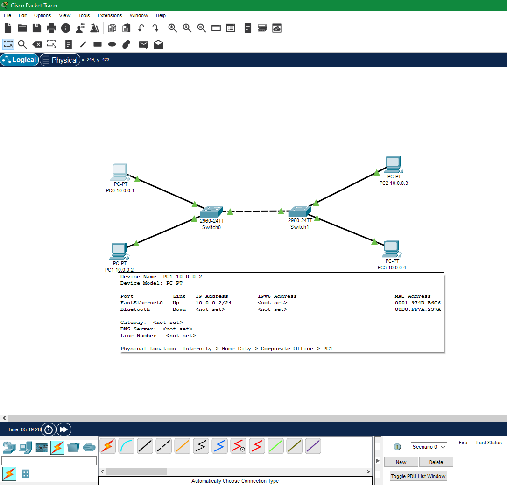
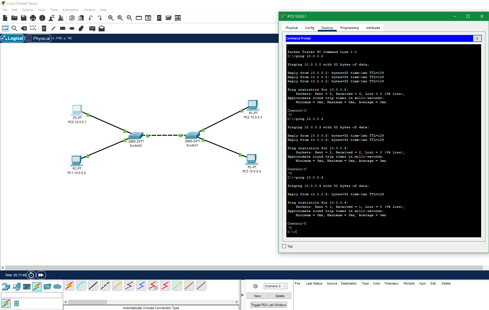
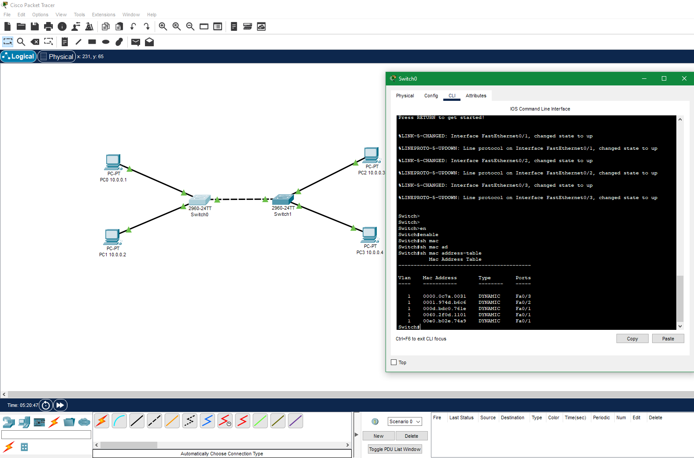

## Домашнее задание к занятию 1.4 Функции, возможности и характеристики сетевых устройств.  

---   

#### Задание 1.

В программе Cisco Packet Tracer составьте сеть, состоящую из двух коммутаторов, к каждому из которых подключено по два компьютера.

*Приведите ответ в виде снимка экрана.*
 
#### Решение.  

  

---  

#### Задание 2.

Настройте адреса компьютеров из подсети 10.0.0.* и маской 255.255.255.0

Проверьте связь с помощью ping.

*Приведите ответ в виде снимка экрана удачной работы утилиты ping.*  

#### Решение.  

  

---  

#### Задание 3.

Перейдите на коммутатор и выполните команду **show mac-address-table**

*Приведите ответ в виде снимка экрана.*  

#### Решение.  

  
