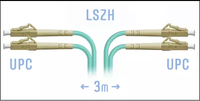

## Домашнее задание к занятию 1.3 Типы и характеристики физических сетей Ethernet  

---

#### Задание 1.

Cкоммутировать между собой 10Gbit\s порты коммутаторов SW_1 и SW_2.

- Коммутаторы расположены в соседних стойках, расстояние по прямой между ними 1 метр.
- В порты установлены SFP+ SR  MM 850nm

Вопрос: какой патч-корд выбрать, чтобы выполнить задачу?
Укажите все характеристики патч-корда: тип, длину, разъемы.

*Приведите ответ в свободной форме.*  

#### Решение.  

  
Например такой патч-корд. Длина может быть различной, зависит от наличия и расположения кабельных органайзеров.  
Тип полировки коннектора - UPC  
Тип волокна - многомод, класс не ниже ОМ3   
Тип коннектора - LC

---

#### Задание 2

При коммутации медных FastEthernet портов коммутаторов линк согласуется только в 10Mbit\s. Длина линии немного больше 100 метров. 

Почему скорость не поднимается выше 10Mbit\s? Что нужно изменить, чтобы линки поднялись на 100Mbit/s? 

*Приведите ответ в свободной форме.*

#### Решение.  

Медные линии Ethernet со скоростью 100Mbit\s ограниченны 100м. Поэтому нужно менять медный провод на оптический. Или, если есть возможность, ставить коммутатор до 100м, но такое решение экономически нецелесообразно.  
