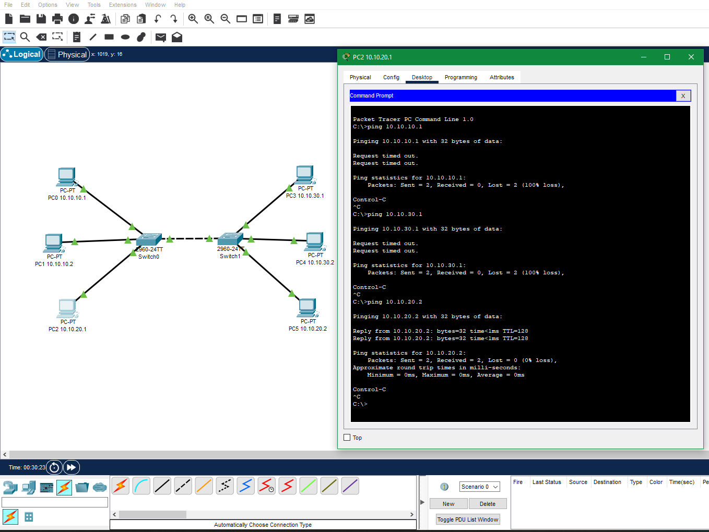

## Домашнее задание к занятию 2.1 Принципы коммутации. VLAN.  

---  

### Лабораторная работа "Создание VLAN"
### Задание 1. 

В программе Cisco PacketTracer составьте сеть из двух коммутаторов и компьютеров.

Создайте три VLAN так, чтобы:

- в каждой из них находилось минимум два компьютера;
- хотя бы одна VLAN была на разных коммутаторах.

Проверьте связь между хостами командой ping.

*Приведите ответ в виде pkt-файла.*  

### Ответ.  

Проверка связи на скриншоте, [ссылка на .pkt файл](https://disk.yandex.ru/d/86cm2OkItHSpwg) 

    

--- 
