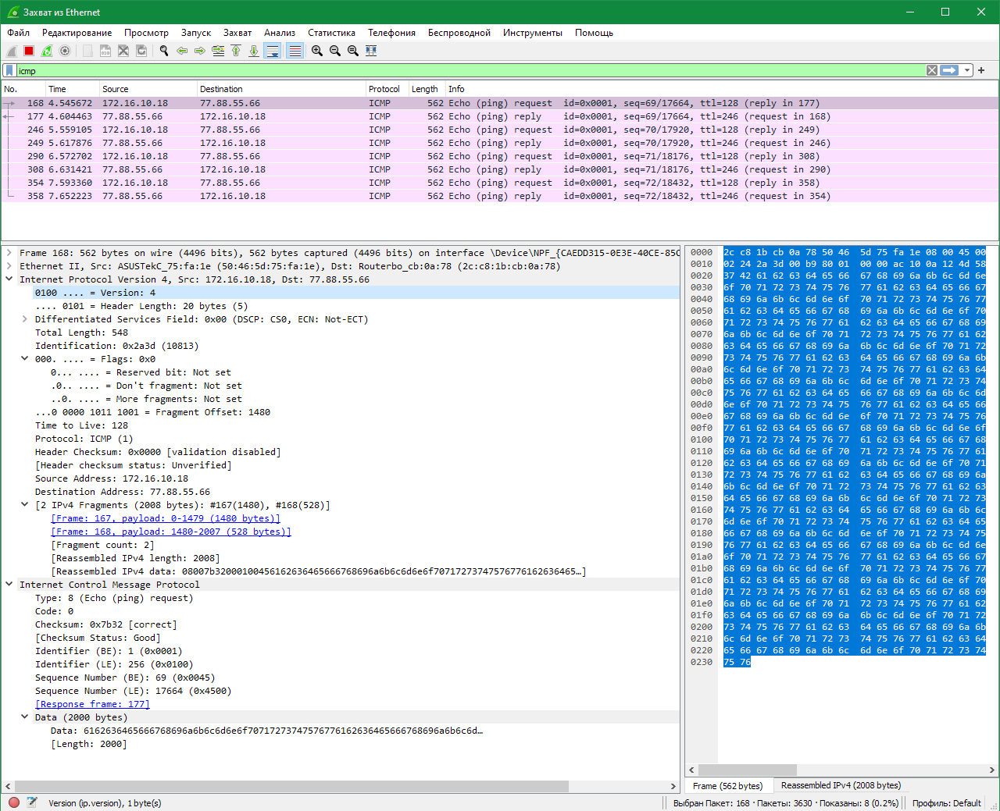
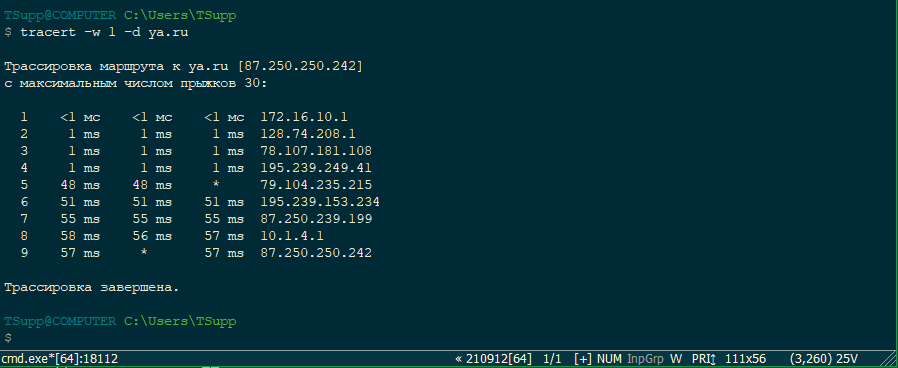
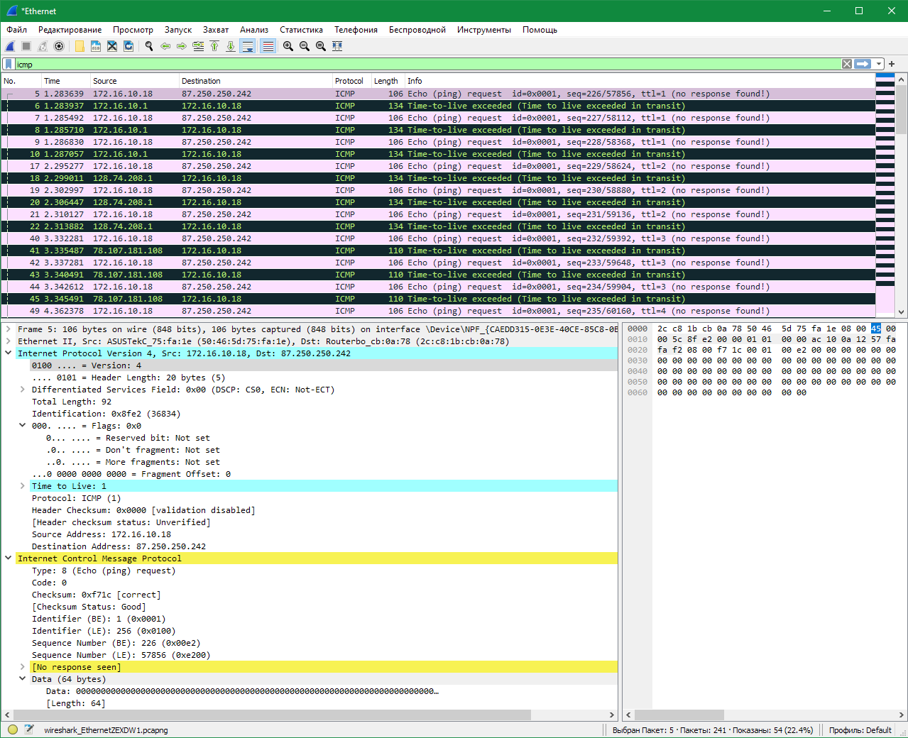

## Домашнее задание к занятию 2.2 IPv4/6 заголовки. Формат заголовков и важные служебные поля в них.  

---  
 
### Задание 1.

1. Запустите ПО Wireshark.
2. Настройте фильтр таким образом, чтобы отображались все фрагменты исходного пакета.
3. Запустите cmd.exe. Нажмите сочетание Win + r.
4. В появившемся окне напишите "cmd". Нажмите "OK".
5. Откроется командная строка.
6. Выполните команду ping до любого адреса пакетами размером более 1500 байт, например ya.ru.

Сколько пакетов до указанного в ping адреса отправлено?

Какие флаги в полях IPv4 заголовка установлены и почему?

*Ответ приведите в виде скриншотов с дампа wireshark. Пояснения к дампу- в свободной форме.*  

### Ответ.  

Так как MTU ограничен 1500 байт, а пакеты ping 2000 байт (в данном примере) и в Windows по умолчанию отправляется 4 пакета, то после фрагментации роутер отправил 8 пакетов.  

На скриншоте можно увидеть флаги фрагментации, а также количество и размер фрагментов.  

  

---  

### Задание 2.

1. Запустите cmd.exe. Нажмите сочетание Win + r.
2. В появившемся окне напишите "cmd".Нажмите "OK".
3. Откроется командная строка.
4. Выполните трассировку до сайта ya.ru. Команда для запуска трассировки tracert. Лучше запускать с ключами -w 1 -d.
Справку по ключам можно получить, выполнив tracert --help.

Сколько хопов в вашей трассировке?

Какие значения TTL установлены в заголовке IPv4 пакета для каждого хопа?

Какой тип icmp сообщения возвращался на каждом этапе трассировки?

Какие src\dst адреса установлены в заголовке IPv4 для пакетов на каждом хопе, почему в исходном запросе и в ответе они отличаются?

Заголовки пакетов проанализируйте в дампе Wireshark. 

*Ответ приведите в виде скриншотов с дампа wireshark. Пояснения к дампу - в свободной форме.*  

### Ответ.  

  
  
Всего хопов до ya.ru 9  
Как работает Tracert:  
* отправляется IP-пакет (echo-reply) на указанный узел (в данном примере ya.ru) со значением поля TTL=1  
* первый маршрутизатор на пути пакета уменьшает TTL и дропает (уничтожает) пакет  
* маршрутизатор отправляет ICMP уведомление (echo-request), что пакет уничтожен, т.к. TTL стал равен 0     
* утилита Tracert извлекает из ICMP пакета IP-адрес маршрутизатора, отправившего echo-request, измеряет потраченное время на прохождение пакета до маршрутизатора  
* если не указано иное в параметрах запуска Tracert, то посылается запрос DNS-серверу и определяется доменное имя маршрутизатора (если такое имеется)  
* в консоль выводится IP-адрес (или доменное имя) первого маршрутизатора  
* снова отправляется IP пакет на указанный узел, но с TTL=2  
* пакет дропается на втором промежуточном маршрутизаторе  
* процедура повторяется до тех пор, пока не придёт ответ от узла назначения (ya.ru), либо число промежуточных узлов не превысит максимального значения для Tracert - 30 узлов.  

Если на каком-нибудь участке сети возникла проблема (нет маршрута до сети назначения, нет связи со следующим маршрутизатором, нет узла назначения в указанной сети и т.д.), тогда мы увидим вместо времени прохождения пакета звёздочки, а вместо IP адреса маршрутизатора сообщение "Превышен интервал ожидания для запроса".    
Так же некоторые маршрутизаторы могут не ответить на echo-reply, по соображениям безопасности например, тогда получим "Превышен интервал ожидания для запроса" и звездочки в полях времени прохождения пакета.  