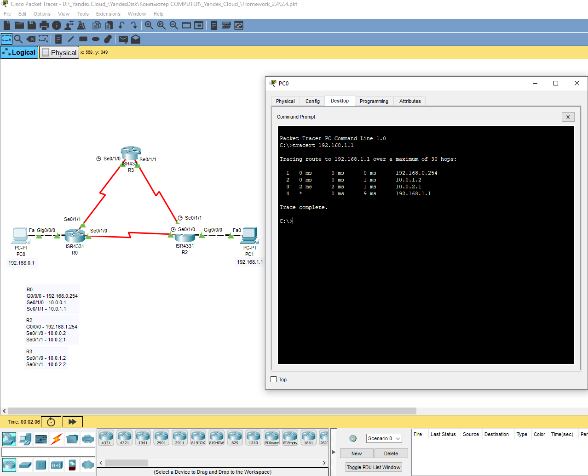

## Домашнее задание к занятию "2.4	Маршрутизация. Шлюз по умолчанию.  Выбор лучшего маршрута."  

---

### Задание 1. Выбор наилучшего маршрута

1. Проанализируйте четыре маршрута:   
   - EIGRP: 192.168.0.0/27   
   - RIP: 192.168.0.0/25     
   - OSPF: 192.168.0.0/27      
   - Static: 192.168.0.0/24   
     
Какие маршруты попадут в таблицу маршрутизации?

2. По какому маршруту будет отправлен трафик с IP-адресом назначения 192.168.0.10?

3. По какому маршруту будет отправлен трафик с IP-адресом назначения 192.168.0.129?

*Приведите ответ в свободной форме.*

### Ответ.  

1. В таблицу маршрутизации попадут все маршруты, **кроме RIP, из-за бОльшей административной дистанции.**     
2. EIGRP.  
3. ~~RIP.~~  **Ошибся, конечно Static.**   

##### могу предположить, что попадет EIGRP, т.к. AD больше и одинаковые сети анонсируются   

---

### Задание 2. Лабораторная работа "Выбор наилучшего маршрута на базе статической маршрутизации"

Соберите тестовую сеть, настройте статическую маршрутизацию для тестовой сети согласно топологии. 

-	Проверьте работоспособность сети. 
-	Измените настройки административной дистанции так, чтобы пакеты маршрутизировались через путь R0 - R3 - R2.

Сделайте вывод, как административная дистанция влияет на маршрут.

*Приведите ответ в свободной форме и пришлите вывод show ip route на всех трех маршрутизаторах.*

### Ответ.  

~~Маршрутизатор принимает решение об установке маршрутов, представленных процессами маршрутизации, основываясь на административной дистанции маршрута.  
Путь с наименьшей административной дистанцией до места назначения (по сравнению с другими маршрутами таблицы), устанавливается в таблицу маршрутизации. Если этот маршрут не является маршрутом с лучшим административным расстоянием, он отклоняется.~~  

Попробую ответить по-другому.  
Административная дистанция — это мера надежности источника маршрута. Если маршрутизатор получает данные о назначении из нескольких протоколов маршрутизации, их административные расстояния сравниваются, и преимущество получают маршруты с меньшим административным расстоянием.  
В данном случае AD выставлена вручную так, чтобы маршрут получился через R3, что видно на скриншоте "tracert".  
Скриншоты и конфигурации маршрутизаторов переделаны.   

R0  
  

R3  
  

R2  
  

Tracert  
  

---  

### Задание 3. Лабораторная работа "Выбор наилучшего маршрута на базе динамической маршрутизации"

Соберите тестовую сеть, настройте протокол маршрутизации rip для тестовой сети согласно топологии. 

-	Проверьте работоспособность сети. 
-	Подключите R6 и R7 маршрутизаторы в разрыв линии R2-R4 маршрутизаторов. Вместо соединения R2-R4 должно быть R2-R6-R7-R4.
-	Выполните их настройку. 
-	Протестируйте полученную сеть. 

Как подключение маршрутизаторов повлияло на метрики выбора маршрута и почему, какие выводы вы можете сделать до и после подключения.

*Приведите ответ в свободной форме и пришлите pkt файл.*

### Ответ.  

Поскольку в протоколе RIP в качестве метрики используется количество транзитных переходов (хопов), то  
до подключения маршрутизаторов R6 и R7 трафик шел через R2 и R4.  
При подключении дополнительных роутеров R6 и R7 увеличивается количество хопов по этому маршруту, поэтому трафик пойдет через R3, т.к. переходов меньше (если не настраивать метрики вручную).  

Проверка связи на скриншоте, [ссылка на .pkt файл](https://disk.yandex.ru/d/lHd8pI7UoDCnOA)
  

---  
