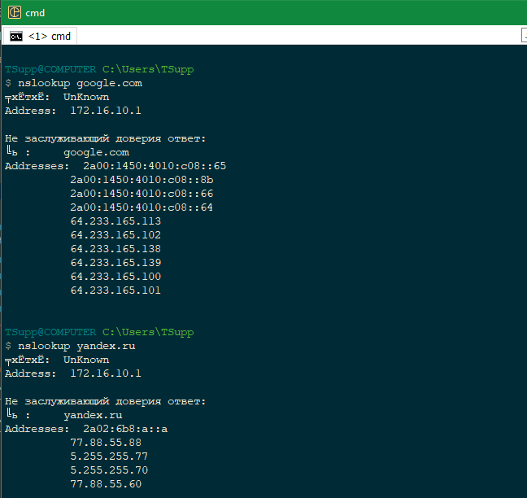
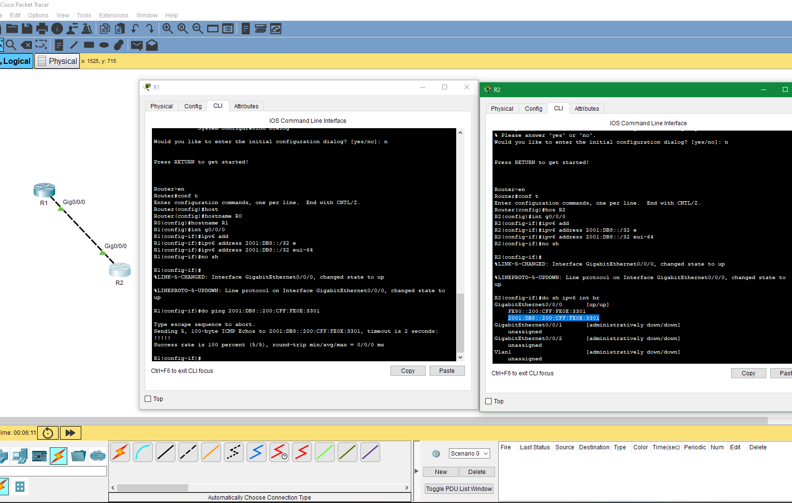

## Домашнее задание к занятию "2.5. Основы IPv6 (Базовые понятия, сравнение с IPv4, принципы построения подсетей)."

---  

### Задание 1.

Какого типа трафика нет в IPv6, но который имеется в IPv4? Что предусмотрено взамен?

*Приведите ответ в свободной форме.*

### Ответ.  

В IPv6 предусмотрено три типа трафика: unicast, multicast и anycast.  
В IPv6 не существует широковещательных (Broadcast) адресов, их функции переданы мультикастинг-адресам.

---

### Задание 2.

Используя любую консольную утилиту получите IPv6-адрес для какого либо ресурса.

*Пришлите скриншот.*

### Ответ.  

 

---  

### Задание 3.

Какие из этих префиксов содержатся в адресе: 2001:DB8:2314:5678::9ABC:DEF0?

a)2001:DB8:2314:5::/52

b)2001:DB8:2314:5678::9AB8:0/109

c)2001:DB8:2314:5660::/59

d)2001:DB80::/27

### Ответ.  

Префиксы под пунктами б) и с).

---  

### Задание 4. Лабораторная работа "Конфигурация сетевых интерфейсов на основе IPv6".

В Cisco Packet Tracer создайте два маршрутизатора (R1 и R2) и настройте между ними адресацию по IPv6 с помощью глобальных адресов.

*Приведите скриншоты, где R2 доступен по ICMPv6 с R1 по ICMPv6*

*Пришлите pkt файл.*

### Ответ.  

[ссылка на .pkt файл](https://disk.yandex.ru/d/skVsAKW0iXEzdA)  

  

---