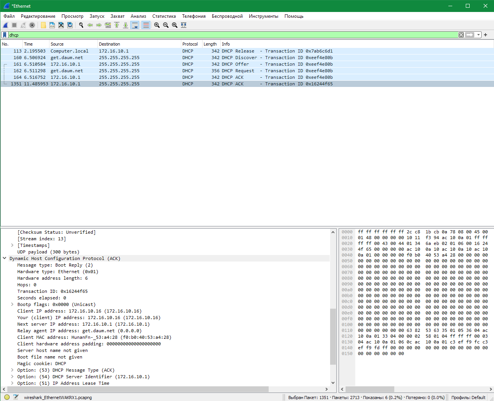
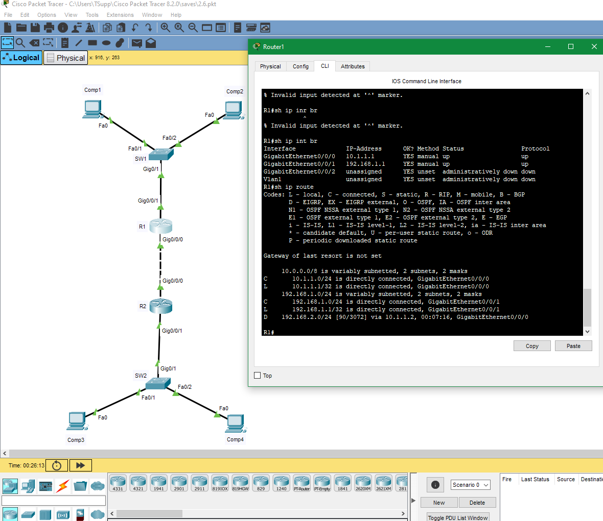

## Домашнее задание к занятию 2.6 Путь пакета в коммутируемой и маршрутизируемой среде. ARP, DHCP, DNS.
 
---  

### Задание 1.

На основном интерфейсе вашего ПК (или виртуальной машины) посмотрите дамп трафика через tshark или Wireshark.

*Приведите скриншоты, где показаны основные моменты работы протокола ARP и DHCP.*

### Ответ.  

Пакеты ARP-Probe и ARP-Announcement  
  

Процесс получения IP адреса от DHCP сервера  
  

---  

### Задание 2.

Как настраивается для сетевого пакета размер MTU в сетях, использующих только протокол IPv6?

*Приведите ответ в свободной форме.*

### Ответ.  

В версии IPv6 конечные узлы обязаны найти минимальное значение MTU вдоль всего пути, соединяющего исходный узел с узлом назначения (эта техника называется Path MTU Discovery).  
Маршрутизаторы IPv6 не выполняют фрагментацию, а только посылают ICMP-сообщение о слишком длинном пакете конечному узлу, который должен уменьшить размер пакета.  

---  

### Задание 3. Лабораторная работа "Построение сети и разбор передаваемых в ней пакетов"

1. В Cisco Packet Tracer соберите сеть состоящую из двух маршрутизаторов (R1 и R2), за каждым из которых есть коммутатор (Switch1 и Switch2), а за коммутатором по два компьютера (Comp1, Comp2 и Comp3, Comp4). Все устройства этой сети должны быть доступны между собой.

Сетевые настройки можно использовать следующие:

  - R1 10.1.1.1/27
  - R2 10.1.2.1/27

  *Приведите скриншоты таблицы коммутации и таблицы маршрутизации устройств R1, R2, Switch1, Switch2.
   Пришлите pkt файл.*

2. Как будут выглядеть заголовки пакета на каждом из узловых точек сети из первой части лабораторного задания при обмене данными Comp1 с Comp4? 

  *Приведите ответ в свободной форме.*

### Ответ.  
1. Скриншоты и [ссылка на .pkt файл](https://disk.yandex.ru/d/uDwC4L5tdtCZRg)  

Switch1  
  

R1  
  

R2  
  

Switch2  
  

2. На всем пути от Comp1 до Comp4 пакет пройдет через несколько интерфейсов. Каждый интерфейс имеет свой мак адрес, который и будет меняться (мак интерфейса отправителя и получателя).  
   Для этого должны быть заполнены таблицы коммутации и маршрутизации.  
  

---  