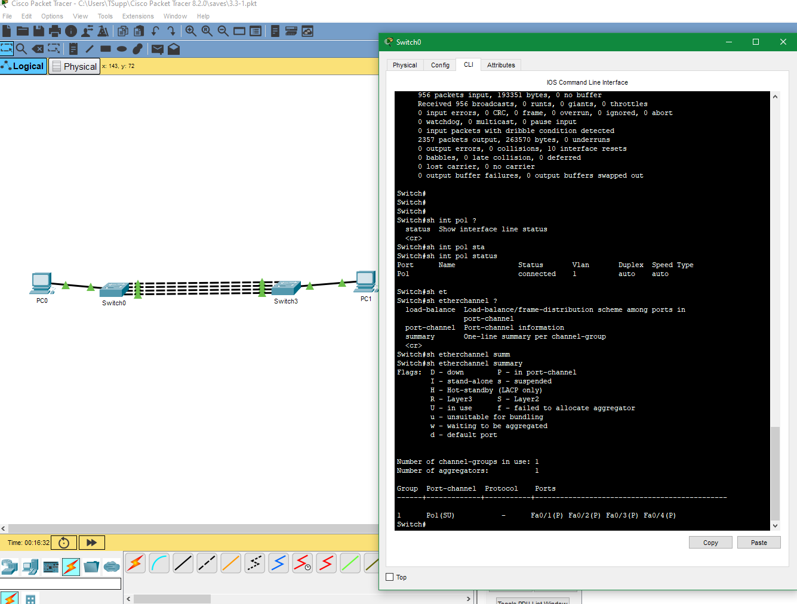
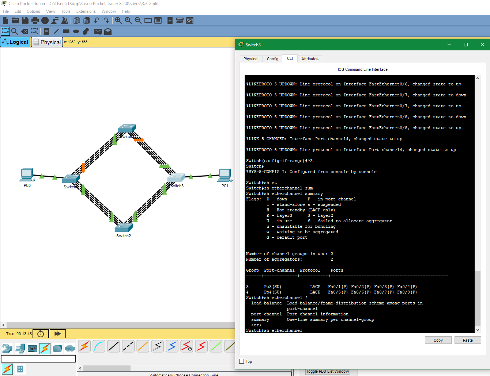
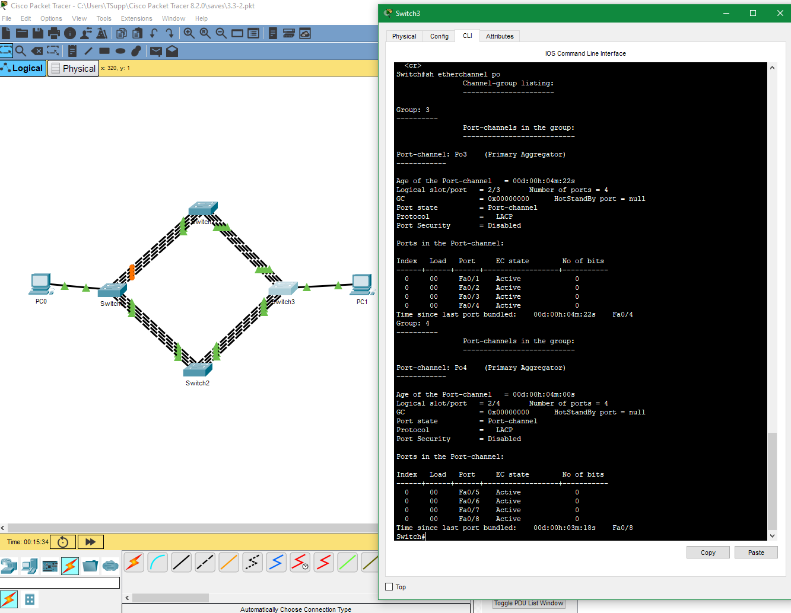
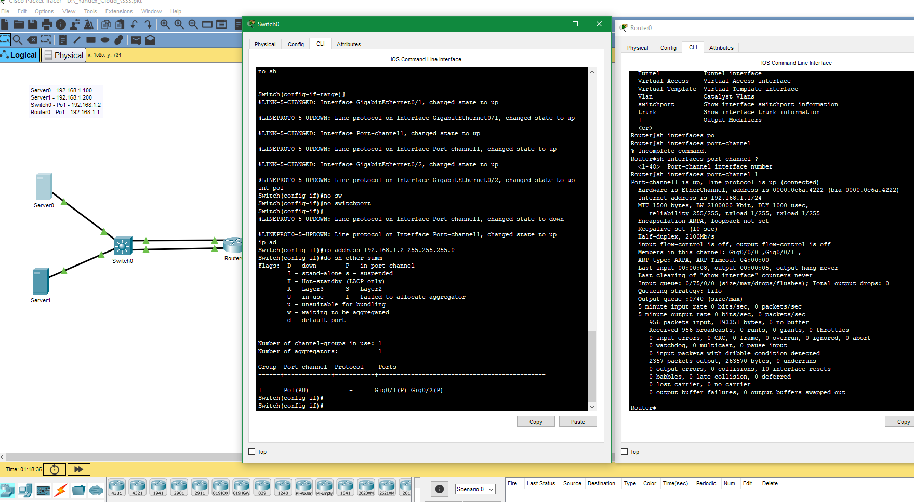

## Домашнее задание к занятию "Методы логического объединения интерфейсов. Балансировка нагрузки, протоколы"  

---  

### Задание 1
Компания ОАО «XXX – век» планирует увеличить пропускную способность канала связи. К вам поступила заявка: настроить статическую агрегацию для сети.
Необходимо настроить и проверить доступность компьютеров, проверить настройки через пространство команд show.

Пришлите pkt с полученным проектом.  

### Ответ  

[.pkt файл](https://disk.yandex.ru/d/xqcnazGdlxyCPA) и скрин проверки  
  

---  

### Задание 2

Компания ОАО «XXX – век» после модернизации и расширения сети задумалась над резервированием существующего агрегированного канала.    
К вам поступила заявка: настроить динамическую агрегацию каналов для сети, так как есть риск разрыва соединения на основных интерфейсах.   

Необходимо: 
- настроить сетевое оборудование и проверить доступность компьютеров,
- проверить настройки через пространство команд show, 
- проверить работу после отключения основных интерфейсов.

*Пришлите pkt с полученным проектом*  

### Ответ  

[.pkt файл](https://disk.yandex.ru/d/6cs3x0pBSWuAKA) и скрины проверки    
  
  

---  

### Задание 3

Компания ОАО «XXX – век» разместила в своей сети сетевые сервисы. Для увеличения полосы пропускания, повышения надежности и реализации высокой доступности серверов и расположенных на них сервисах Вам поставили задачу доработать топологию сети с учетом возможностей оборудования и настроить балансировку на основе ip адресов источника и получателя.
 
Необходимо: 
- настроить и проверить доступность компьютеров, 
- проверить настройки через пространство команд show.    

**Важно!** В эмуляторе Cisco Packet Tracer есть особенность: часть настроек сетевого оборудования в этой лабораторной работе не сохраняется, когда вы сохраняете ее в .pkt файл.  
**Решение**: На всех сетевых устройствах после окончания настройки нужно выполнить команду "write" или "copy running-config startap-config".
 

*Пришлите pkt с полученным проектом*  

### Ответ  

[Ссылка на .pkt файл](https://disk.yandex.ru/d/GtgtASVakutqPA)  

