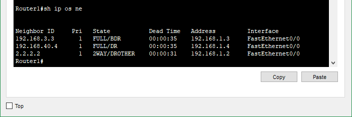

## Домашнее задание к занятию "Протокол OSPF. Построение соседства, машина состояний, LSDB"  

---

## Лабораторная работа "Базовая конфигурация протокола OSPF"

Топология


---  

### Задание 1. Запуск протокола OSPF 

Запустите протокол OSPF:  
 - Анонсируйте ip адреса Fa0/0, Fa0/1 и Loopback 0 в Area 0;
 - Проверьте наличие маршрутов OSPF в таблице маршрутизации;
 - Проверьте наличие связности всех Loopback адресов со всех маршрутизаторов.
 
*Выполните необходимую конфигурацию и приложите список сделанных команд для каждого маршрутизатора.*

### Ответ.  

<details>  
<summary>Команды для роутеров</summary>  

````
R1  
en  
conf t  
router ospf 1  
router-id 1.1.1.1  
network 1.1.1.1 255.255.255.255 area 0  
network 192.168.1.1 0.0.0.255 area 0  
network 209.45.185.231 0.0.0.255 area 0  

R2  
en  
conf t  
router ospf 1  
router-id 2.2.2.2  
network 2.2.2.2 255.255.255.255 area 0  
network 192.168.1.2 0.0.0.255 area 0  
network 172.16.1.2 0.0.0.255 area 0  

R3  
en  
conf t  
router ospf 1  
router-id 3.3.3.3  
network 3.3.3.3 255.255.255.255 area 0  
network 192.168.1.3 0.0.0.255 area 0  
network 192.168.3.3 0.0.0.255 area 0  

R4  
en  
conf t  
router ospf 1  
router-id 192.168.40.4  
network 192.168.40.4 255.255.255.255 area 0  
network 192.168.1.4 0.0.0.255 area 0  
network 192.168.4.1 0.0.0.255 area 0  
````
 
</details>

Проверка  
  

---  

### Задание 2. Проверка построения соседства

1. Выключите интерфейс Fa0/0 на одном из маршрутизаторов, подождите 40 секунд.  
2. Включите Packet Simulation в Packet Tracer на этом порту.  
3. Включите интерфейс и посмотрите процесс установления соседства на пакетном уровне.  
В данных пакетах OSPF найти поле AreaID. В каких пакетах передается AreaID? В каком формате передается?

*Выполните необходимую конфигурацию и приведите ответы на вопросы в свободной форме.*

### Ответ.  

Поле AreaID передается во всех пакетах.  
Может быть указан в десятичном формате или в формате записи IP-адреса.  

---

### Задание 3. Оповещение соседей о потерянном маршруте

После установления соседства, отключите Loopback 0 на Router4 и посмотрите, каким образом произойдет оповещение соседей о потере маршрута. Посредством чего OSPF маршрутизатор
оповещает соседей о потерянном маршруте?

*Приведите ответы на вопросы в свободной форме.*

### Ответ.  

Каждый маршрутизатор отвечает за те записи в LSDB, которые описывают связи, исходящие от данного маршрутизатора.  
При образовании новой связи, изменении в состоянии связи или ее исчезновении (обрыве), маршрутизатор должен изменить свою копию  
LSDB и немедленно известить все остальные маршрутизаторы OSPF-системы о произошедших изменениях, чтобы они также внесли исправления в свои копии базы данных.  
Эту задачу в OSPF выполняет Flooding protocol.  
Всеми маршрутизаторами пересылаются (ретранслируются) сообщения типа "Обновление состояния связей (Link State Update)", получение которых подтверждается сообщениями типа "Link State Acknowledgment".  

---

### Задание 4. Определение DR и BDR

Сделайте предположение, какие маршрутизаторы будут выбраны в качестве DR и BDR.  Узнайте, какие маршрутизаторы выбраны DR и BDR в реальности при помощи команд на маршрутизаторе. 
Какую команду необходимо использовать для получения информации о DR/BDR? Сошлись ли предположения с реальностью? Если нет, то почему?

*Приведите ответы на вопросы в свободной форме.*

### Ответ.  

Судя по адресам лупбэков Router 4 и Router 3 получается, что:  
DR - Router4  
BDR - Router3  
Посмотреть статус роутеров можно командой `show ip ospf neighbor`  
  

---  

### Задание 5. Диагностика работы протокола

1. Какой командой узнать RouterID?
2. Какой командой узнать список анонсированных сетей?
3. Какой командой узнать список соседей?
4. Какой командой узнать список интерфейсов, на которых активирован OSPF?
5. Какой командой перезапустить процесс OSPF?

*Приложите список сделанных команд.*   

### Ответ.  

1. `show ip protocols`, `show ip ospf`  
2. `sh ip ospf interface`, `show ip ospf database router`   
3. `sh ip ospf neighbor`, `show ip ospf database network`    
4. `sh ip ospf interface brief`  
5. `clear ip ospf process`  

---  


