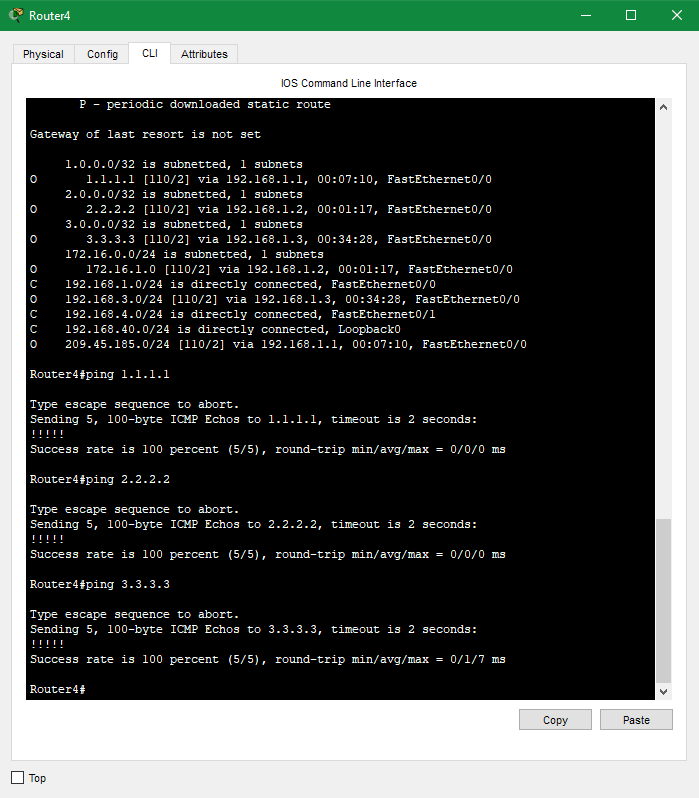

## Домашнее задание к занятию "Протокол OSPF. Построение соседства, машина состояний, LSDB"  

---

## Лабораторная работа "Базовая конфигурация протокола OSPF"


-----  

### Задание 1. Запуск протокола OSPF 

Запустите протокол OSPF:  
 - Анонсируйте ip адреса Fa0/0, Fa0/1 и Loopback 0 в Area 0;
 - Проверьте наличие маршрутов OSPF в таблице маршрутизации;
 - Проверьте наличие связности всех Loopback адресов со всех маршрутизаторов.
 
*Выполните необходимую конфигурацию и приложите список сделанных команд для каждого маршрутизатора.*

### Ответ.  

<details>  
<summary>Команды для роутеров</summary>  

````
R1  
en  
conf t  
router ospf 1  
router-id 1.1.1.1  
network 1.1.1.1 255.255.255.255 area 0  
network 192.168.1.1 0.0.0.255 area 0  
network 209.45.185.231 0.0.0.255 area 0  

R2  
en  
conf t  
router ospf 1  
router-id 2.2.2.2  
network 2.2.2.2 255.255.255.255 area 0  
network 192.168.1.2 0.0.0.255 area 0  
network 172.16.1.2 0.0.0.255 area 0  

R3  
en  
conf t  
router ospf 1  
router-id 3.3.3.3  
network 3.3.3.3 255.255.255.255 area 0  
network 192.168.1.3 0.0.0.255 area 0  
network 192.168.3.3 0.0.0.255 area 0  

R4  
en  
conf t  
router ospf 1  
router-id 192.168.40.4  
network 192.168.40.4 255.255.255.255 area 0  
network 192.168.1.4 0.0.0.255 area 0  
network 192.168.4.1 0.0.0.255 area 0  
````
 
Проверка  
  
 
</details>

