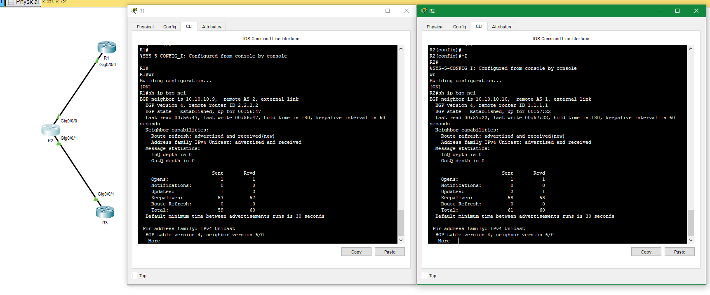

## Домашнее задание к занятию "Маршрутизация в сети Интернет. Автономные системы"  

---  

### Задание 1

Маршрутизатор А объявляет свою собственную сеть 172.17.1.0 своим одноранговым узлам BGP. 
- Какой маршрутной информацией будет обладать маршрутизатор D о доступности сети 172.17.1.0?
- Как будут выглядеть атрибуты AS-path? 
- Через какие роутеры пройдет трафик при передаче информации от маршрутизатора D к маршрутизатору А?

*Приведите ответ в свободной форме.*

### Ответ.  

- В маршрутной информации будет указан полный путь до сети - AS-path, версия протокола, ID маршрутизатора.   
- В виде полного пути с указанием номеров AS.  
- Полагаю через Router E. Если не указаны политики.  

---  

### Задание 2

Что означает следующий узел 0.0.0.0 в выходных данных команды show ip bgp?

*Приведите ответ в свободной форме.*

### Ответ.  

Предпочесть локальный маршрут маршрутизатора. Другими словами сеть локальная.   

---  

### Задание 3. Лабораторная работа "Настройка конфигурации BGP"

В Cisco Packet Tracer соберите сеть, состоящую из двух маршрутизаторов R1 и R2, находящиеся в разных AS. Настройте между ними BGP.

*Приведите скриншоты, где на R1 и R2 BGP-соединение в статусе Established. Пришлите pkt файл.*

### Ответ.  

  

Статус
  

[Ссылка на .pkt](https://disk.yandex.ru/d/oSyXrovNTHIeJw)  

---

