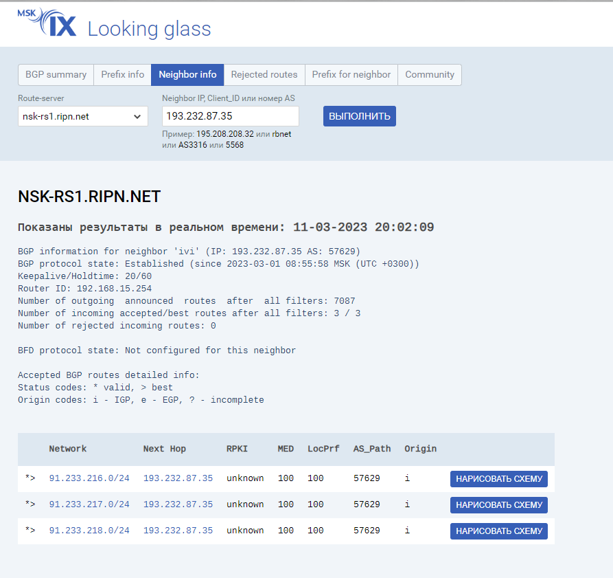

## Домашнее задание к занятию "Отсутствие связности: диагностика и устранение"  

---

### Лабораторная работа "Применение инструментов для диагностики случаев при отсутствии связности сети"

### Задание 1. 
 
Кейс: топология сети на картинке. 
Для построения сети воспользуйтесь Cisco Packet Tracer.
 

Необходимо:
1) настроить маршрутизаторы, используя сетевые настройки, указанные на картинке. Маршрутизация статическая
2) выполнить команду ping между R1 и R3. Результат зафиксировать скриншотом
3) добиться прохождения ping между R1 и R3, используя статическую маршрутизацию. Результат зафиксировать скриншотом. В свободной форме объяснить, что вы сделали, чтобы связь между маршрутизаторами появилась.
 
*Результаты выполнения задания оформить в один документ: скриншоты + текст. Так же предоставить файл .pkt*

---  

### Ответ.  

Чтобы появилась связь между R1 и R3 нужны маршруты. А т.к. маршрутизация статическая, нужно прописать маршруты до нужных сетей на обоих роутерах.  
[Ссылка на .pkt](https://disk.yandex.ru/d/AECto1XO5IzCPA)  

  

Скриншоты
  

  
  

---  

### Задание 2.
 
Кейс: топология сети на картинке.

Для построения сети воспользуйтесь Cisco Packet Tracer.

1) Настройте ospf на маршрутизаторах 
2) Сделайте на каждом маршрутизаторе вывод команд:
- show ip ospf
- show ip ospf  neighbor
- show ip ospf  database
- show ip route ospf
3) В чём проблема? 
 
*Вывод команд оформить в виде скриншотов, ответ на 3 в текстовом виде. Всё оформить в один документ. Также предоставить файл .pkt*

### Ответ.  

В данной топологии проблема в том, что Area0 получилась разорванной.  
Согласно RFC по OSPF, роутер ABR не может передавать LSA Type3, если он получен не из магистральной зоны.  
Здесь ABR - R3. Поэтому маршруты R1 из Area0 к R3 не придут.    

  

R1
  

   

  

R2
  

   

  

R3
  

   

[Ссылка на .pkt](https://disk.yandex.ru/d/AjghIPOaT4dS4w)  

---

### Задание 3.
 
1) Найдите в интернете несколько серверов looking glass. В текстовом файле приложите ссылки 
2) Используя [LG](https://www.msk-ix.ru/lookingglass/)
- выберите один из маршрутизаторов "Route-server" 
- с помощью "BGP summary" найдите идентификатор одного из соседей
- с помощью "Neighbor info" найдите информацию о соседе
В ответе прикрепите скриншот вывода информации и в свободной форме опишите, что вы видите в выводе.
3) Используя whois сайта nic.ru:
- посмотрите информацию о соседе, которого нашли в пункте 2
 
*В ответе прикрепите скриншот вывода информации и в свободной форме опишите, что вы видите в выводе.*
 
### Ответ.  

  

Сервера looking glass
  

https://lg.msk-ix.ru/lookingglass/  
https://lg.selectel.ru/#/  
http://lg.gldn.net/  

  

  
Можно увидеть автономную систему, RouterID, количество входящих/исходящих/отклоненных маршрутов.  

Whois на nic.ru выдал немного информации, в отличие от 2ip.ru.  
Можно увидеть город, где находится роутер, организацию, контакты ответственных лиц.  

  

nic.ru
  

   

  

2ip.ru
  

  

---