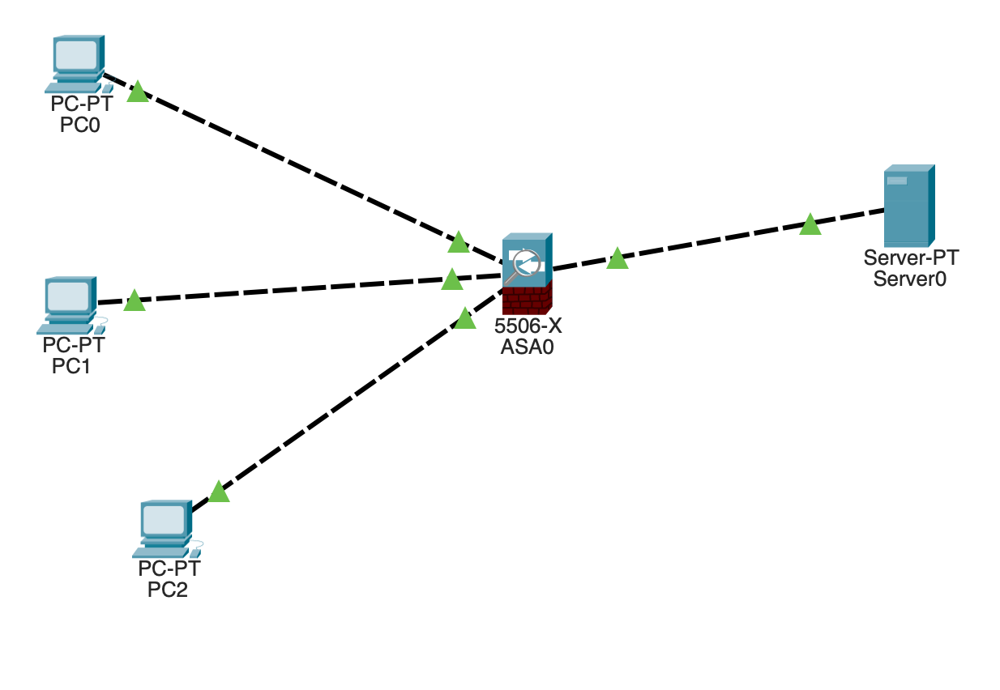
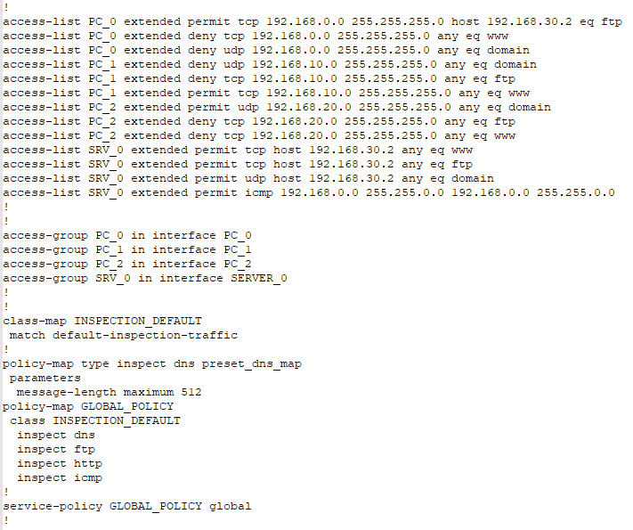

## Домашнее задание к занятию "Основные возможности NGFW"

---

#### Лабораторная работа 1 "Настройка расширенных листов контроля доступа"

Лабораторная работа заключается в настройке сервисов и межсетевого экранирования для разграничения таргетированного трафика между сетями. 

Этапы выполнения:
1. Соберите сеть, предложенную на схеме.

2. Настройте ASA 5506-x для выполнения фильтрации трафика. 

*В качестве решения пришлите pkt файл проекта.*

#### Ответ.

[Ссылка на .pkt](https://disk.yandex.ru/d/3hloZV58vzVa_Q)  

---

#### Лабораторная работа 2 "Настройка инспектирования трафика"

Лабораторная работа заключается в настройкe правил инспектирования сетевого трафика на прикладном уровне. 

Ваша задача - настроить политику инспектирования по листам доступа для предложенных сетей из лабораторной работы № 1. 

*В качестве решения пришлите скриншоты полученных отчетов по принятым политикам.*

#### Ответ.

  

Скрин политик
  

    

---