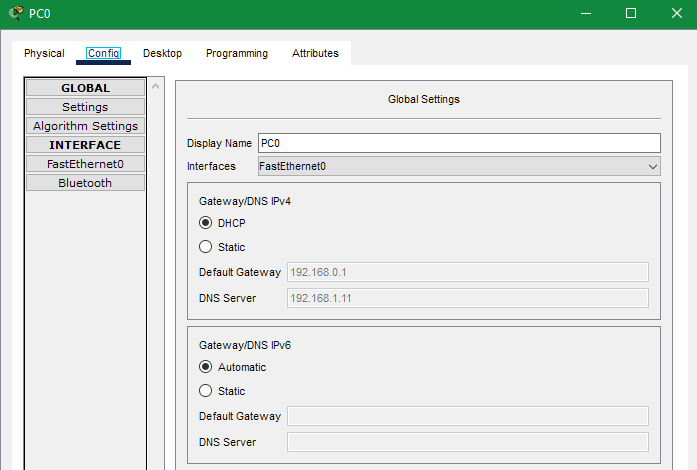
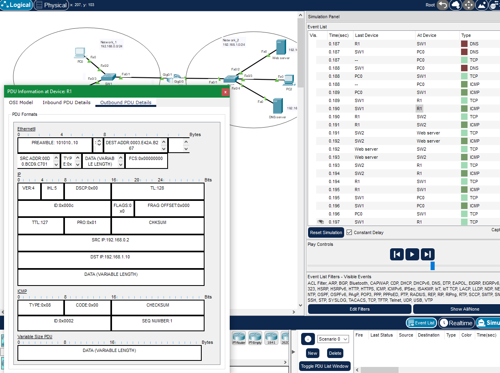
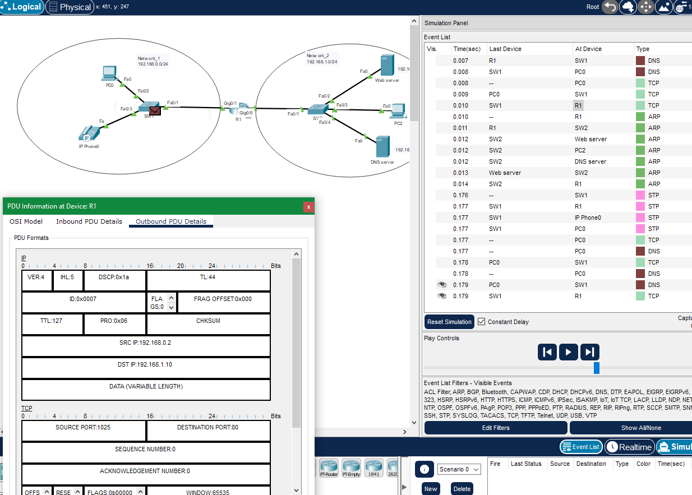
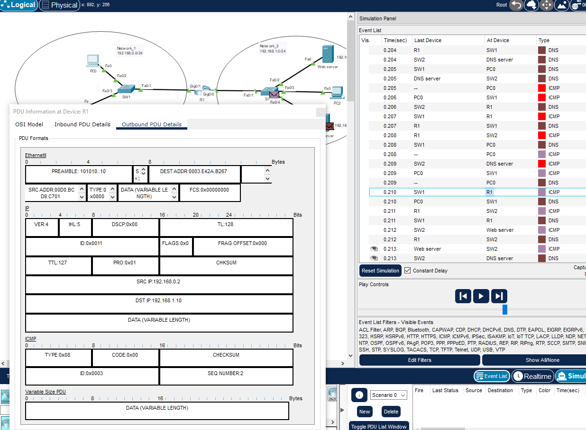

## Домашнее задание к занятию "Качество обслуживания в сетях Ethernet. Модели QOS (Best Effort, IntServ, DiffServ)"  

---  

На [примере сети](https://github.com/netology-code/qos-homeworks/blob/main/7-01/qos7_1_homework.pkt) выполните следующие задания:

### Задание 1. 

На компьютере PC0 необходимо выполнить следующие действия:
   1. Проверить, получен ли ip адрес от dhcp сервера.
   2. В режиме симуляции PT, в Command Prompt выполнить ICMP запрос до ресурса cisco.com.
   3. В режиме симуляции PT, на маршрутизаторе R1 раскрыть пакет ICMP запроса и оценить, применены ли какие-либо метки DSCP.
   4. Выбрать ниже из списка верное значение DSCP (вариантов может быть более одного):  
      
      а. AF31  
      б. CS6  
      в. 0х1а  
      г. AF11  
      д. 0x0a  
      е. Не применяется, т.е. 0х00  
 
*В ответе приведите номера выбранных пунктов. Вариантов может быть более одного.*

### Ответ.  

  

DHCP сервер отработал.
  

  

  

Значение DSCP.
  

е. 0x00  

  

---

### Задание 2. 

На компьютере PC0 необходимо выполнить следующие действия:
   1. Проверить, получен ли ip адрес от dhcp сервера.
   2. В режиме симуляции PT, в Web Browser выполнить WEB запрос до ресурса cisco.com.
   3. В режиме симуляции PT, на маршрутизаторе R1 раскрыть пакет WEB запроса и оценить, применены ли какие-либо метки DSCP.
   4. Выбрать ниже из списка верное значение DSCP (вариантов может быть более одного):  
     
      а. AF31  
      б. CS6  
      в. 0х1а  
      г. AF11  
      д. 0x0a  
      е. Не применяется, т.е. 0х00

*В ответе приведите номера выбранных пунктов. Вариантов может быть более одного.*

### Ответ.  

  

Значение DSCP.
  

в. 0х1а   

  

---

### Задание 3.

На компьютере PC0 необходимо выполнить следующие действия:
   1. Проверить, получен ли ip адрес от dhcp сервера.
   2. В режиме симуляции PT, в Command Prompt выполнить команду nslookup ya.ru.
   3. В режиме симуляции PT, на маршрутизаторе R1 раскрыть пакет DNS запроса и оценить, применены ли какие-либо метки DSCP.
   4. Выбрать ниже из списка верное значение DSCP (вариантов может быть более одного):
     
      а. AF31  
      б. CS6  
      в. 0х1а  
      г. AF11  
      д. 0x0a  
      е. Не применяется, т.е. 0х00  

*В ответе приведите номера выбранных пунктов. Вариантов может быть более одного.*

### Ответ.  

  

Значение DSCP.
  

в. 0х00   

  

---  

### Задание 4.

Подключиться к R1 и в режиме User Exec Mode(">") просмотреть статистику с интерфейсов маршрутизатора.
Необходимо определить, на каком из интерфейсов выполняется установка меток DSCP (show policy map ....), выбрать верный вариант из списка:
       
 а. Gig0/1  
 б. Gig0/0  

*В ответе приведите номера выбранных пунктов.*

### Ответ.  

а. Gig0/1  

---